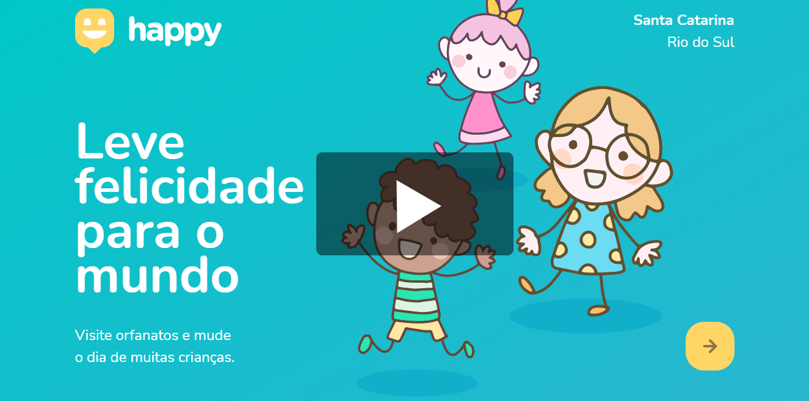
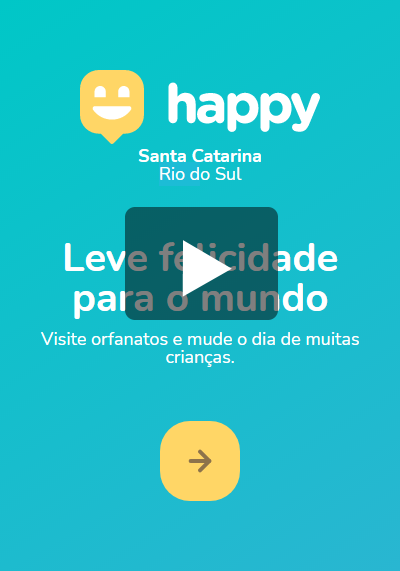

# Projeto Happy

## Sobre

Este repositório faz parte do projeto Happy, desenvolvido durante a <a href="https://nextlevelweek.com/inscricao/3/" target="_blank">Next Level Week #3</a> promovida pela <a href="https://rocketseat.com.br" target="_blank">RocketSeat</a>.

### Este Repositório

Este repositório contém o sistema web desse projeto ('front end' e 'back end'), isto é, um sistema acessado por um navegador, como o Mozilla Firefox ou Google Chrome.

**Nota**

A trilha deste projeto é a "Discovery".

## Ideia do Projeto

Criar uma conexão entre orfanatos localizados na cidade de Rio do Sul - SC e os habitantes da cidade.
O objetivo da plataforma é que as instituições da cidade sejam conhecidas pelos habitantes de Rio do Sul possibilitando que elas possam ser auxiliadas por cada vez mais pessoas.

**Nota**

Somente instituições interessadas seriam cadastradas no Happy.

## Links Externos

* RocketSeat: [https://rocketseat.com.br](https://rocketseat.com.br)

* Site Oficial "Next Level Week #3": [https://nextlevelweek.com/inscricao/3/](https://nextlevelweek.com/inscricao/3/)

* Grupo no Discord: [https://discord.com/invite/as33qEE](https://discord.com/invite/as33qEE)

* Página Notion do projeto [https://www.notion.so/Front-end-010548f316d04d65a0d8b72865874ed1](https://www.notion.so/Front-end-010548f316d04d65a0d8b72865874ed1)

## Stakeholders

**Instituições**  
Orfanatos ou instituições não governamentais que oferecem amparo a crianças e adolescentes em situação de risco.  

**Cidadãos**  
Moradores da cidade de Rio do Sul que utilizam a plataforma para obter informações sobre as instituições cadastradas. Os cidadão serão os usuários da plataforma.

## Funcionalidades

A plataforma oferece as seguintes funcionalidades para os cidadãos:

* Ver as instituições cadastradas em um mapa como o Google Maps;
* Ver informações detalhadas sobre determinada instituição;
* Cadastrar instituições.

*Observação*

Nesta 1ª versão do projeto, assume-se que somente moradores específicos terão acesso à plataforma, por isso o cadastro de instituições é liberado sem restrições.

## Funcionalidades desenvolvidas durante a Next Level Week #3

* Página index com responsividade;
* Página com mapa que exibe as instituições;
* Página de cadastro de instituições;
* Página que exibe detalhes de instituições.

## Aperfeiçoamentos implementados

* Responsividade as demais páginas do projeto;
* Página de erro;
* Geração de Logs no caso de erros no backend.

## Tecnologias utilizadas

* **Front end**

    * HTML;
    * CSS;
    * Javascript.
    * Foi utilizada a biblioteca **Leafletjs** no projeto para implementação do mapa.

* **Back end**

    * Node;
    * Banco de dados SQLite.

## Demonstração do Site

**Versão Desktop**

**Versão Mobile**

